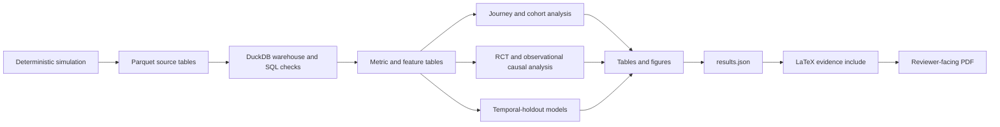

# Pulse

Pulse is a reproducible customer-analytics case study for a fictional digital bank. It follows one decision path: acquisition, onboarding, activation, retention, intervention evaluation, churn scoring, and contact economics.

The repository uses synthetic data. It demonstrates an auditable analytical workflow. It does not establish production performance or customer impact.

## The problem

A digital bank needs to decide where to focus early-lifecycle work. The team must answer four linked questions:

1. Where do customers drop from signup to sustained engagement?
2. Does an activation intervention increase first-week activation?
3. What can an observational retention campaign estimate when randomization is unavailable?
4. Can a model and an economic policy identify profitable contacts?

Pulse keeps these questions separate. Randomized estimates support the activation decision. Observational estimates remain conditional on design assumptions. Predictive scores rank customers. Unit economics decide whether contact is worthwhile.

## What is built

- Deterministic synthetic customer, event, transaction, experiment, campaign, and product tables.
- An India-informed lifecycle simulation with delayed activation, reactivation, changing cohort mix, and an explicit public-evidence boundary.
- DuckDB warehouse models and SQL validation checks.
- A single metric contract for activation, D7/D30/D60/D90 retention, and churn.
- A customer journey and cohort analysis with generated tables and figures.
- A randomized activation experiment with balance, guardrail, effect, confidence-interval, and power outputs.
- A selected-region campaign analysis with difference-in-differences and stabilized inverse-probability-of-treatment weighting (IPTW) diagnostics.
- Temporal-holdout churn and response propensity models with calibration, lift, and monitoring outputs.
- An economic targeting policy that compares contact-all, risk, value, response, and expected-value strategies.
- A runtime-driven A4 LaTeX case-study report generated from the frozen artifacts.

## Main findings

<!-- BEGIN GENERATED FINDINGS -->
<!-- Generated from artifacts/results.json by scripts/update_readme.py. -->
The frozen full run contains 100,000 synthetic customers covering 2025-01-01 through 2026-01-25.

- The randomized intervention increases first-week activation by 9.16 percentage points. The recorded 95% confidence interval is +8.28 to +10.05 percentage points for eligible customers.
- Mature-cohort retention declines from 29.7% at D7 to 23.6% at D30, 20.5% at D60, and 16.3% at D90.
- The selected churn model is a regularized logistic model. It records ROC AUC 0.752 and top-decile lift 2.673 on a later temporal holdout. This is a modest predictive association, not a causal treatment-benefit estimate.
- The observational campaign estimate is a 1.03 percentage-point unweighted DiD effect and a 0.95 percentage-point IPTW DiD effect. Its normal-approximation standard error ignores within-customer correlation.
- Every positive-contact strategy has negative expected net value under the fictional assumptions in [`config/economics.yml`](config/economics.yml). The expected-value strategy contacts 0 customers and records 0 expected net value.

The decision is therefore narrow: keep the activation intervention behind a controlled experiment, and do not launch a positive-contact campaign under these assumptions. A rollout still requires incremental-value evidence, guardrail monitoring, and refreshed unit economics.
<!-- END GENERATED FINDINGS -->

## Strongest evidence

These figures provide the shortest route through the project:

- [Customer journey funnel](artifacts/figures/journey_funnel.png)
- [RCT activation effect and confidence interval](artifacts/figures/rct_effect_ci.png)
- [Temporal churn model comparison](artifacts/figures/churn_model_comparison.png)
- [Targeting strategy expected value](artifacts/figures/targeting_strategy_value.png)

The full recruiter-facing artifact is [`reports/pulse_case_study.pdf`](reports/pulse_case_study.pdf).

## Architecture



The warehouse owns canonical metric tables. Analysis utilities calculate statistics over those tables. The report owns narrative and reads the generated manifest, tables, and PNG figures at runtime. The LaTeX input generator validates key denominators before it writes the report include.

## Reproduce

The shortest full path is:

```bash
make setup
make all
```

The equivalent explicit dependency install is:

```bash
uv sync --extra dev --locked
```

Run the full 100,000-customer pipeline:

```bash
uv run pulse-pipeline --profile full --data-dir data/generated --artifact-dir artifacts
```

Run the test suite and Ruff:

```bash
uv run --locked pytest -q
uv run --locked ruff check .
uv run --locked ruff format --check .
```

Build the report from the generated artifacts:

```bash
make report
```

`make report` runs `scripts/build_latex_inputs.py`, validates the report denominators, and compiles [`reports/pulse_case_study.tex`](reports/pulse_case_study.tex) with `tectonic` from `PATH`. Set `TECTONIC=/path/to/tectonic` when the executable is elsewhere. The generated evidence include is [`reports/pulse_case_study_inputs.tex`](reports/pulse_case_study_inputs.tex). Tectonic writes the PDF to [`reports/pulse_case_study.pdf`](reports/pulse_case_study.pdf).

## Artifacts

- [`artifacts/results.json`](artifacts/results.json) records the run-level manifest, headline metrics, claim scopes, assumptions, and limitations.
- [`artifacts/tables/`](artifacts/tables/) contains journey, cohort, experiment, causal, modelling, monitoring, economics, and SQL outputs.
- [`artifacts/figures/`](artifacts/figures/) contains PNG and SVG figures generated from the tables.
- [`reports/pulse_case_study.pdf`](reports/pulse_case_study.pdf) is the reviewer-facing technical report produced from the generated LaTeX evidence include.
- [`notebooks/`](notebooks/) contains six executed analytical working documents that read the generated evidence rather than duplicating pipeline logic.
- [`docs/metric_definitions.md`](docs/metric_definitions.md), [`docs/methodology.md`](docs/methodology.md), and [`docs/experiment_design.md`](docs/experiment_design.md) record the metric, causal, and experiment contracts.
- [`docs/external_calibration.md`](docs/external_calibration.md) records the SBI, Axis Bank, HDFC Bank, ICICI Bank, and Kotak Mahindra Bank disclosures used as directional design evidence.

## Limitations

- All data are behaviourally plausible synthetic simulation. They are not customer data.
- Indian-bank public disclosures inform lifecycle structure only. They do not publish comparable Pulse-style signup-cohort retention, so the synthetic D7/D30/D60/D90 levels are not peer benchmarks.
- Random assignment supports the activation result only for the stated eligible population and primary metric.
- The selected-region campaign is observational. Difference-in-differences depends on parallel trends and related assumptions. IPTW diagnostics address measured balance and overlap, not unmeasured confounding.
- The reported IPTW uncertainty uses a normal approximation on weighted customer-week means and ignores within-customer correlation.
- Churn and response propensity models measure predictive association. They do not estimate incremental treatment benefit or uplift.
- The economic policy depends on fictional treatment-effect, value, contact-cost, incentive-cost, and capacity assumptions.
- The full pipeline can regenerate artifacts. Generated data and outputs are not a substitute for a production data-quality, privacy, or deployment review.
