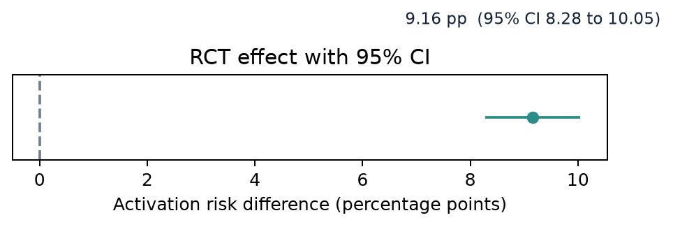
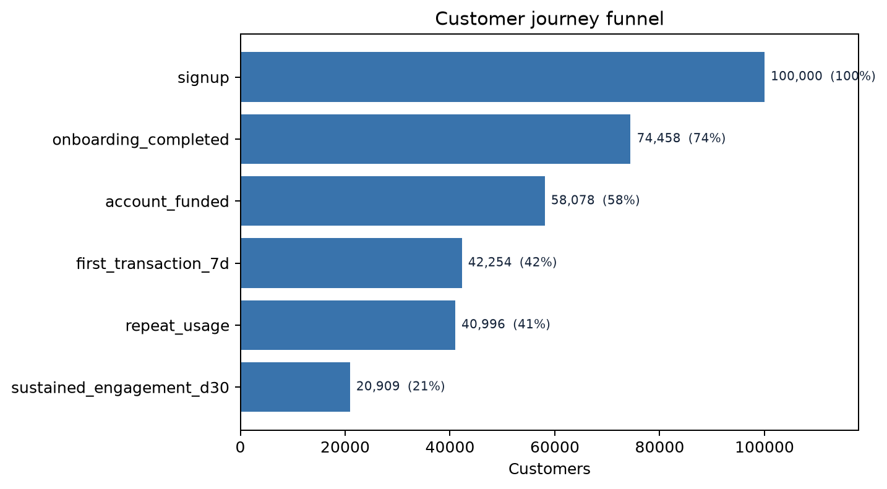
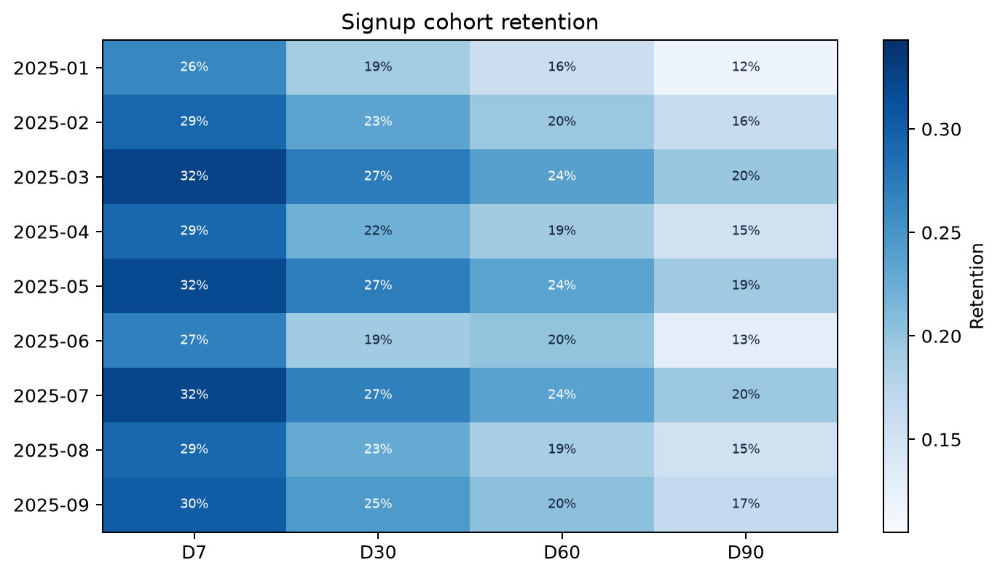
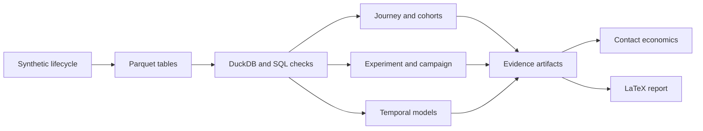

# Pulse

[](https://github.com/lakshayxi/pulse/actions/workflows/ci.yml)
[](pyproject.toml)
[](LICENSE)

Pulse tests where a digital bank should intervene across activation, retention, churn risk, and contact economics.

The central result is deliberate: a positive activation effect does not justify outreach with negative expected value. Every customer and outcome is synthetic.

**Start here:** [reviewer report](reports/pulse_case_study.pdf) · [results manifest](artifacts/results.json) · [executed notebooks](notebooks/)

---

## Decision in one minute

<!-- BEGIN GENERATED FINDINGS -->
<!-- Generated from artifacts/results.json by scripts/update_readme.py. -->
The frozen full run contains 100,000 synthetic customers covering 2025-01-01 through 2026-01-25.

- **Activation:** 37,340 eligible customers produce a +9.16 percentage-point risk difference. The 95% confidence interval is +8.28 to +10.05 points.
- **Retention:** Mature retention moves from 29.7% at D7 to 23.6% at D30, 20.5% at D60, and 16.3% at D90.
- **Campaign:** Difference-in-differences estimates +1.03 percentage points. Stabilized inverse-probability-of-treatment weighting estimates +0.95 percentage points.
- **Churn ranking:** Receiver operating characteristic area under the curve is 0.752. Top-decile lift is 2.673 on 11,728 holdout customers.
- **Contact policy:** Every strategy that contacts customers loses value under the fictional assumptions. The expected-value policy contacts 0 customers and records 0 expected net value.

Under these synthetic assumptions, continue controlled activation testing. Do not launch customer outreach.
<!-- END GENERATED FINDINGS -->



The randomized estimate applies to the synthetic eligible population. It does not establish profit, durable retention, or external validity.

---

## The lifecycle uses different denominators

Overall D30 retention is 23.604%. Sequential sustained D30 engagement is 20.909%. The metrics answer different questions.



The simulation does not force each cohort window to decrease. The June 2025 cohort rises from 19.18% at D30 to 20.02% at D60.



This increase represents simulated reactivation. Public Indian-bank disclosures informed lifecycle structure, not these numerical retention levels.

---

## How Pulse reaches a decision

1. Generate deterministic customers, events, transactions, experiments, campaigns, and product holdings.
2. Materialize metric tables in DuckDB and validate them with SQL checks.
3. Estimate randomized and observational intervention effects under separate claim boundaries.
4. Evaluate churn and response models on later temporal holdouts.
5. Combine predicted risk, response, value, cost, and capacity in the contact policy.
6. Generate tables, figures, notebooks, and the reviewer-facing LaTeX report from one evidence layer.



## Run it

Requires Python 3.11 or 3.12 and [`uv`](https://docs.astral.sh/uv/).

```bash
git clone https://github.com/lakshayxi/pulse
cd pulse
uv sync --extra dev --locked

# Run the fast profile used by continuous integration.
uv run --locked python -m pulse.pipeline --profile ci
uv run --locked pytest -q
```

Regenerate the full 100,000-customer evidence layer:

```bash
uv run --locked python -m pulse.pipeline --profile full
```

Build the report with `tectonic` available on `PATH`:

```bash
make report
```

## Inspect the evidence

| Artifact | What it establishes |
|---|---|
| [`artifacts/results.json`](artifacts/results.json) | Headline metrics, denominators, assumptions, and claim scopes |
| [`artifacts/tables/`](artifacts/tables/) | Detailed journey, experiment, campaign, model, monitoring, and economics outputs |
| [`notebooks/`](notebooks/) | Six executed analytical walkthroughs |
| [`docs/metric_definitions.md`](docs/metric_definitions.md) | Activation, retention, churn, and denominator contracts |
| [`docs/methodology.md`](docs/methodology.md) | Identification, evaluation, monitoring, and economic assumptions |
| [`reports/pulse_case_study.pdf`](reports/pulse_case_study.pdf) | Formal 11-page reviewer report |

## Boundaries

- All data come from a deterministic synthetic simulation. They are not customer data.
- Indian-bank disclosures inform lifecycle structure only. They do not provide comparable retention benchmarks.
- Random assignment supports the activation estimate only for the stated eligible population and outcome.
- The campaign estimate depends on parallel trends, measured overlap, and no unmeasured confounding.
- Churn and response scores are predictive. They do not estimate incremental treatment benefit.
- Contact economics use fictional effects, values, costs, incentives, and capacity.

## License

[MIT](LICENSE)
